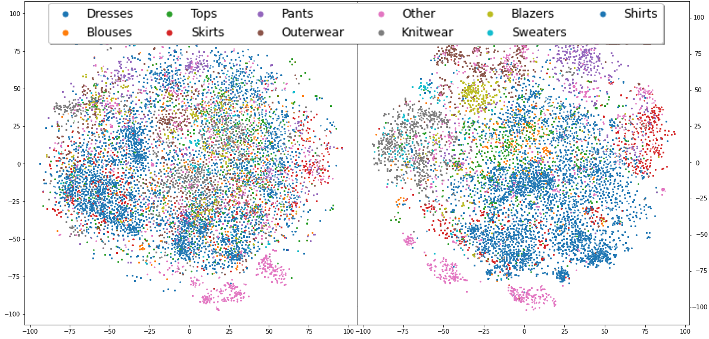

# CorrEmbed_Evaluating_Pre-trained_Model_Efficacy
Code for the paper "CorrEmbed: Evaluating Pre-trained Model Efficacy with a Novel Metric Integrating Image Embedding and Tag Correlation"

As the dataset, unfortunately, is private, we'll be omitting all of the code not directly related to the calculation of CorrEmbed.

# Figure 3

# Figure 4

# Figure 5

# Figure 6

